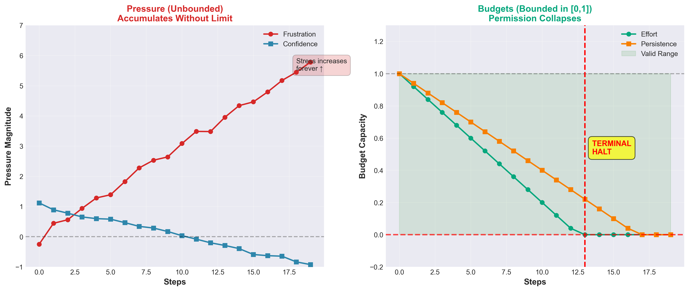
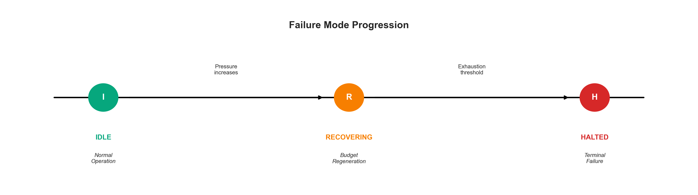

# EmoCore


EmoCore is a runtime governor that forces autonomous systems to halt when they stop making progress.

Modern agents can reason, plan, and retry — but they do not know when to stop.
EmoCore adds a deterministic execution-time control layer that guarantees finite-time halting under sustained non-progress, exhaustion, or unsafe conditions.

This is not a policy.
This is not alignment.
This is a hard execution boundary.

## Table of Contents
- [Why EmoCore Exists](#why-emocore-exists)
- [What EmoCore Does](#what-emocore-does-at-runtime)
- [Integrations](#integrations)
- [Installation](#installation)
- [Quick Start](#quick-start)
- [Test Coverage](#test-coverage)
- [Real-World Examples](#real-world-examples)
- [How EmoCore Works](#how-emocore-works-mental-model)
- [API Reference](#api-reference-inputs)
- [Guarantees](#guarantees-what-you-can-rely-on)
- [Documentation](#documentation-suite)

---

## Why EmoCore Exists

Autonomous systems fail structurally, not cognitively.

In production, engineers observe:
- Agents retrying the same action forever
- Multi-agent systems deadlocking but continuing to run
- Urgency causing reckless escalation instead of stopping
- External timeouts killing processes without understanding internal state
- Silent degradation (“zombie agents”) that keep consuming tokens, time, or compute

Policy-level intelligence cannot enforce bounded execution.

EmoCore exists to solve one problem only:
> Guarantee that an autonomous system halts in finite time when progress stalls.

---

## What EmoCore Does (At Runtime)

EmoCore sits between your agent loop and execution.

It does not choose actions.
It does not inspect reasoning.
It decides whether the system is still allowed to act.

Conceptually:
```text
┌────────────────────────┐
│     Environment        │
│  (reward, urgency…)    │
└───────────┬────────────┘
            ↓
┌────────────────────────┐
│   Agent / LLM /        │
│   Planner / Controller │
│   (chooses actions)    │
└───────────┬────────────┘
            ↓
┌────────────────────────┐
│      EmoCore           │
│  Runtime Governor      │
│  • Tracks stress       │
│  • Enforces budgets    │
│  • Decides HALT / GO   │
└───────────┬────────────┘
            ↓
┌────────────────────────┐
│   Action Execution     │
│   (tools, APIs, motors)│
└────────────────────────┘
```

Execution is no longer “run unless killed”. Execution becomes permissioned.

---

## Observable Behavior (Not Philosophy)

EmoCore provides mechanical guarantees you can see happen:

1. **Deterministic halting** under zero or negative progress
2. **Explicit failure modes**:
   - `EXHAUSTION`: Budget depleted due to sustained effort without recovery.
   - `STAGNATION`: Progress stalled for longer than `stagnation_window`.
   - `OVERRISK`: Risk budget exceeded safety threshold.
   - `SAFETY`: Exploration budget exceeded limits.
   - `EXTERNAL`: Hard step limit reached (`max_steps`).

3. **No learning, no randomness, no drift**:
   - Identical governance behavior across agents and models.
   - Irreversible halting (no silent recovery).
   - If the same signals are fed in, the same halt always occurs.

---

## What EmoCore Is NOT

This is critical. EmoCore is not:

❌ A policy or planner
❌ Reinforcement learning
❌ Alignment or preference modeling
❌ Emotion simulation
❌ A model wrapper or prompt technique
❌ A replacement for agent logic

> EmoCore does not influence what the system thinks — it only enforces whether it may continue acting.

---

## How EmoCore Works (Mental Model)

EmoCore maintains two internal layers:

### 1. Pressure (Unbounded)
Pressure represents accumulated execution stress:
- Repeated failure
- Lack of progress
- Urgency
- Difficulty

Pressure accumulates without bound via the `integrate()` function.

### 2. Budgets (Bounded)
Budgets represent permission to act:
- **Effort**: Energy available for action.
- **Persistence**: Wille to continue despite failure.
- **Risk**: Tolerance for unsafe actions.
- **Exploration**: Allowance for novelty seeking.

Budgets are strictly bounded in `[0, 1]` via clamping.

```text
Pressure (Unbounded)              Budgets (Bounded)
──────────────────────            ───────────────────
Frustration   ↑↑↑↑↑               Effort        ┌───┐
Urgency       ↑↑↑                 Persistence   │   │
Difficulty    ↑↑                  Risk          │   │
                                  Exploration   └───┘
     (accumulates forever)        (clipped to [0,1])

          ↑                               ↓
   Stress increases            Permission collapses
                               ↓
                           TERMINAL HALT
```

> **Key asymmetry**: Pressure can grow forever. Permission cannot.



Under sustained stress, permission always collapses.

### 3. Dynamic Recovery
Before halting, EmoCore attempts to recover.
If pressure lifts, the system enters `RECOVERING` mode:
- Effort and persistence regenerate.
- Risk is frozen (safety interlock).
- If stress returns before full recovery, exhaustion accelerates.

This mimics biological "second wind" mechanics — but deterministically.

---

## Failure Semantics (What Happens When Things Go Wrong)

EmoCore checks failure conditions every step, in priority order (defined in `engine.py`):

| Priority | Condition | Failure Type | Result |
|:---|:---|:---|:---|
| 1 | Exploration > max_exploration | `SAFETY` | Halts |
| 2 | Risk > max_risk | `OVERRISK` | Halts |
| 3 | Effort ≤ exhaustion_threshold | `EXHAUSTION` | Halts |
| 4 | Stagnating & Low Effort | `STAGNATION` | Halts |
| 5 | Steps ≥ max_steps | `EXTERNAL` | Halts |

> **When EmoCore halts, the system is done unless externally reset.**

This is fail-closed by design.



---

---

## Integrations

EmoCore works seamlessly with popular agent frameworks. See the [`integrations/`](integrations/) folder for ready-to-run examples.

### 🦜️🔗 LangChain
```python
from integrations.langchain_ollama import run_governed_agent
# Wraps standard LangChain loops with EmoCore governance
```

### 🤖 AutoGen
```python
from integrations.autogen_ollama import run_governed_autogen
# Governs multi-agent conversations to prevent infinite chat loops
```

### 🚣 CrewAI
```python
from integrations.crewai_ollama import run_governed_crew
# Enforces budgets on role-based agent crews
```

[**Browse all 8 integration examples →**](integrations/)

---

## Installation

### Option 1: Local Development Install

```bash
git clone https://github.com/Sarthaksahu777/Emocore
cd Emocore
pip install -e .
```

To use EmoCore in your project:

```bash
pip install emocore
```

Then import it in your code:

```python
from emocore import EmoCoreAgent, step, Signals
```

### Option 2: Configuration
You can select different governance profiles at initialization:

```python
from emocore import EmoCoreAgent, PROFILES, ProfileType

# 1. Balanced (Default): Good for general tasks
agent = EmoCoreAgent()

# 2. Conservative: Halts early on risk/uncertainty
agent = EmoCoreAgent(PROFILES[ProfileType.CONSERVATIVE])

# 3. Aggressive: Tolerates higher risk/exhaustion
agent = EmoCoreAgent(PROFILES[ProfileType.AGGRESSIVE])
```

---

## API Reference: Inputs

The `step()` function accepts three normalized signals `[0.0, 1.0]`:

| Signal | Meaning | Effect on Governance |
|:---|:---|:---|
| `reward` | Progress towards goal | High reward maintains **Effort/Persistence**. Zero reward generally triggers **Stagnation**. |
| `novelty` | New/unexpected info | High novelty boosts **Curiosity/Exploration**. |
| `urgency` | Time/resource pressure | High urgency burns **Effort** faster but boosts short-term **Risk Tolerance**. |

---

## Minimal Example (60-Second Test)

```python
from emocore import EmoCoreAgent, step, Signals

# Initialize with default "BALANCED" profile
agent = EmoCoreAgent()

print("Agent started.")

while True:
    # 1. Feed signals from the environment
    # reward=0.0 simulates no progress
    result = step(agent, Signals(reward=0.0, novelty=0.0, urgency=0.1))
    
    # 2. Check strict halting condition
    if result.halted:
        print(f"Agent halted! Reason: {result.reason} ({result.failure})")
        break
        
    print(f"Step {agent.engine.step_count}: Effort={result.budget.effort:.2f}")

# Result: The system halts deterministically in finite steps.
```

**Want to use it with LangChain or AutoGen?**  
See the [Integrations](#integrations) section above for framework-specific examples.

**Result:**
The system halts deterministically.
- No timeouts.
- No heuristics.
- No model cooperation required.

---

---

## Test Coverage

EmoCore is rigorously tested for production reliability.

- ✅ **Unit Tests**: High core logic coverage (~60 tests)
- ✅ **Integration Tests**: Verified with LangChain, AutoGen, CrewAI, OpenAI SDK
- ✅ **Benchmarks**: Low overhead per governance step
- ✅ **LLM Testing**: Validated with local models (Gemma, Qwen)

[](https://github.com/Sarthaksahu777/Emocore/actions)

---

## Guarantees (What You Can Rely On)

EmoCore guarantees:
- **Finite-time halting** under sustained non-progress.
- **Deterministic behavior**: Same history = same outcome (using fixed matrices).
- **Irreversible halting**: Once halted, budget remains zeroed (`guarantees.py`).
- **Model-agnostic control**: Works with any agent architecture.
- **No silent degradation**: Failures are explicit and typed.

These are execution guarantees, not performance claims.

---

## Real-World Examples

EmoCore has been tested in these common failure scenarios (see [`examples/`](examples/)):

1. **[The Retry Storm](examples/retry_storm.py)**  
   Halts an agent that keeps hitting API errors (e.g., HTTP 500) without backoff.

2. **[The Infinite Loop](examples/infinite_loop_fix.py)**  
   Detects and stops "exploration theater" where an agent pretends to work but repeats actions.

3. **[File Churn Attack](examples/file_churn_detection.py)**  
   Identifies agents that cycle state (write/delete/write) to game progress metrics.

4. **[Boring Success](examples/boring_success.py)**  
   Demonstrates that EmoCore stays out of the way during normal, healthy operation.

[**View all behavioral examples →**](examples/)

---

## Who Should Use EmoCore

**Use EmoCore if:**
- Your system runs for many steps.
- Retries automatically.
- Uses tools or APIs.
- Consumes tokens, time, or compute.
- Must not run forever.

**Do not use EmoCore if:**
- You are doing single-shot prompting.
- You want learning or optimization.
- You expect graceful degradation instead of hard stops.

---

## Roadmap

- **v0.7 (Current)**: Stable release with automated signal extraction and framework adapters. (Released Jan 2026)
- **v1.0 (Planned)**: Native framework integrations and formal verification.

---

## Documentation Suite

For deep details, see the `docs/` directory. All documents were updated to reflect v0.7 stable semantics (Jan 2026):

- [**Technical Definition**](docs/DEFINITION.md) — Core properties and fundamental logic.
- [**Architecture & Lifecycle**](docs/ARCHITECTURE.md) — Component responsibilities and terminality invariants.
- [**Failure Modes**](docs/FAILURE_MODES.md) — Specification of `EXHAUSTION`, `OVERRISK`, and `STAGNATION`.
- [**Terminology**](docs/TERMINOLOGY.md) — Definitive meanings for data primitives and system states.

---

## One-Line Summary

> EmoCore enforces bounded agency by guaranteeing finite-time halting for autonomous systems — regardless of how the model behaves.

---
*Stable Release v0.7.0 | Verified Jan 25, 2026*
