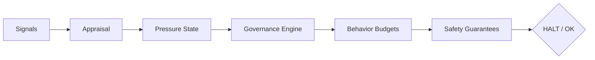

# EmoCore v0.7 — Runtime Governance for Autonomous Systems

EmoCore is a deterministic **runtime governance engine** designed to regulate the agency of autonomous systems. It decouples *behavioral regulation* (how much permission to act) from *behavioral selection* (what actions to take), providing a fail-closed safety layer for high-autonomy agents.

## Core Value Proposition

In complex autonomous systems, failure often emerges from structural issues like infinite loops, runaway escalation, or silent degradation. EmoCore addresses these by enforcing **explicit failure semantics** and **bounded behavioral envelopes**.

- **Fail-Closed Semantics**: Immediate terminal halt upon invariant breach.
- **Agency Regulation**: Maps accumulated internal pressure to real-valued behavioral budgets (Effort, Risk, Exploration).
- **Auditability**: Provides a verifiable state machine for behavioral constraints, independent of the intelligence layer (LLM, Policy, Planners).

## System Architecture

EmoCore operates as a synchronous, one-way pipeline in the agent's inner loop:



- **Signals**: Reward, Novelty, Urgency.
- **Budgets**: Effort, Risk Tolerance, Exploration, Persistence.
- **Modes**: `IDLE` (baseline), `RECOVERING` (pre-failure adjustment), `HALTED` (terminal absorber).

## Quick Start

```python
from emocore.agent import EmoCoreAgent
from emocore.profiles import ProfileType

# Initialize with a standard governance profile
agent = EmoCoreAgent(profile_type=ProfileType.BALANCED)

# In your execution loop:
while True:
    # 1. Provide appraisal signals
    # 2. Receive governance result
    result = agent.step(reward=0.1, novelty=0.05, urgency=0.2)
    
    if result.halted:
        print(f"TERMINATED: {result.failure} - {result.reason}")
        break
        
    # 3. Use budgets to modulate downstream policy
    effort_budget = result.budget.effort
    risk_limit = result.budget.risk
```

## Documentation Suite

- [**Technical Definition**](DEFINITION.md) — Core properties and fundamental logic.
- [**Architecture & Lifecycle**](ARCHITECTURE.md) — Component responsibilities and terminality invariants.
- [**Failure Modes**](FAILURE_MODES.md) — Specification of `EXHAUSTION`, `OVERRISK`, and `STAGNATION` conditions.
- [**Why EmoCore?**](WHY_EMOCORE.md) — The engineering problem statement and motivation.
- [**Terminology**](TERMINOLOGY.md) — Definitive meanings for data primitives and system states.

---
> [!IMPORTANT]
> EmoCore v0.7 is a **runtime governor**. It does not perform learning or reasoning. It enforces the behavioral boundaries within which reasoning occurs.

---
*Last Updated: Jan 25, 2026*
